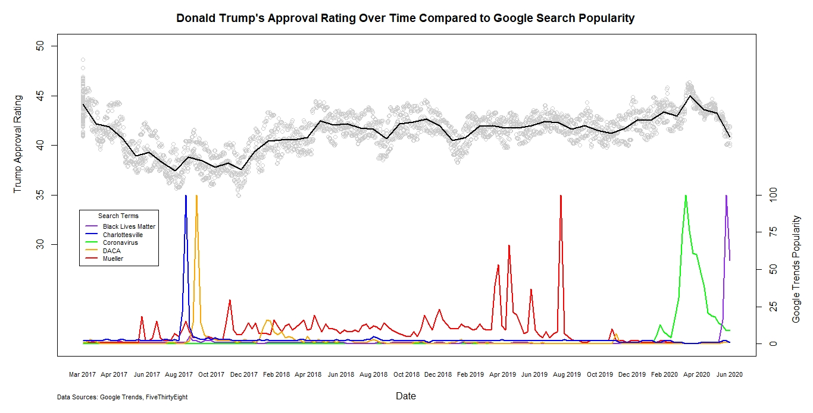

Donald Trump’s Approval Rating Over Time Compared to Google Search Popularity
=============================================================================

First, I downloaded [FiveThirtyEight’s polling
data](https://projects.fivethirtyeight.com/trump-approval-data/approval_topline.csv)
showing Trump’s approval and converted the timestamps to a YYYY-MM-DD
format and kept only data from after his inauguration.

    # Import and clean FiveThirtyEight approval data
    approval = read.csv('approval_topline.csv')
    approval = approval[,c('timestamp', 'approve_estimate')]
    approval$timestamp = as.numeric(as.POSIXct(approval$timestamp, format="%H:%M:%S %d %b %Y"))
    approval$timestamp = as.Date(as.POSIXct(approval$timestamp, origin="1970-01-01"))
    approval = approval[which(approval$timestamp > "2017-01-20"),]

Next, I put each search term individually into [Google Trends
(US)](https://trends.google.com/trends/?geo=US) in order to have each
term on the same scale and downloaded the data. I then replaced rows
with “&gt;1” for popularity with 0’s to make it easier to graph and put
all of the trends data into a single dataframe.

    # Import and clean Google Trends data
    blm_interest = read.csv('blm_interest.csv', stringsAsFactors = FALSE)
    charlottesville_interest = read.csv('charlottesville_interest.csv', stringsAsFactors = FALSE)
    coronavirus_interest = read.csv('coronavirus_interest.csv', stringsAsFactors = FALSE)
    daca_interest = read.csv('daca_interest.csv', stringsAsFactors = FALSE)
    mueller_interest = read.csv('mueller_interest.csv', stringsAsFactors = FALSE)

    nweeks = 260
    interest = data.frame(tail(blm_interest$Week, nweeks), tail(blm_interest$Black.Lives.Matter, nweeks), tail(coronavirus_interest$Coronavirus, nweeks), tail(daca_interest$DACA, nweeks), tail(mueller_interest$Mueller, nweeks), tail(charlottesville_interest$Charlottesville, nweeks), stringsAsFactors = FALSE)
    colnames(interest) = c("Week", "Black.Lives.Matter", "Coronavirus", "DACA", "Mueller", "Charlottesville")
    interest$Week = as.numeric(as.POSIXct(interest$Week, format="%Y-%m-%d"))
    interest$Week = as.Date(as.POSIXct(interest$Week, origin="1970-01-01"))
    interest = interest[which(interest$Week > "2017-01-20"),]

    if(nrow(interest[which(interest$Black.Lives.Matter == '<1'),]) > 0){
        interest[which(interest$Black.Lives.Matter == '<1'),]$Black.Lives.Matter = 0
    }
    if(nrow(interest[which(interest$Charlottesville == '<1'),]) > 0){
        interest[which(interest$Charlottesville == '<1'),]$Charlottesville = 0
    }
    if(nrow(interest[which(interest$Coronavirus == '<1'),]) > 0){
        interest[which(interest$Coronavirus == '<1'),]$Coronavirus = 0
    }
    if(nrow(interest[which(interest$DACA == '<1'),]) > 0){
        interest[which(interest$DACA == '<1'),]$DACA = 0
    }
    if(nrow(interest[which(interest$Mueller == '<1'),]) > 0){
        interest[which(interest$Mueller == '<1'),]$Mueller = 0
    }

Finally, I graphed the approval data with a smoothed line and put the
trends data on the same x-axis, as well as modifying the y-axes for
readability and aesthetics.

    # Plot the data
    par(mar = c(5, 5, 3, 5))
    scatter.smooth(approval, ylim = c(20, 50), span = 1/30, col="#CCCCCC", ylab = "", yaxt = 'n', xlab = "Date", xaxt = 'n', main = "Donald Trump\'s Approval Rating Over Time Compared to Google Search Popularity", lpars = c(lwd = 2))
    mtext("Trump Approval Rating", side = 2, adj = 0.725, line = 3)
    axis(2, at = c(30, 35, 40, 45, 50))
    axis(1, tick = FALSE, approval$timestamp, format(approval$timestamp, "%b %Y"), cex.axis = 0.7)
    par(new = TRUE, ylog = TRUE)
    plot(interest$Coronavirus, col = "#FFFFFF", xaxt = 'n', yaxt = 'n', xlab = '', ylab = '', ylim = c(0, 200))
    lines(interest$Coronavirus, xaxt = 'n', yaxt = 'n', xlab = '', ylab = '', col = 'green', lwd = 2, ylog = TRUE)
    par(new = TRUE)
    lines(interest$Black.Lives.Matter, xaxt = 'n', yaxt = 'n', xlab = '', ylab = '', col = 'purple2', lwd = 2)
    par(new = TRUE)
    lines(interest$Mueller, xaxt = 'n', yaxt = 'n', xlab = '', ylab = '', col = 'red', lwd = 2)
    par(new = TRUE)
    lines(interest$DACA, xaxt = 'n', yaxt = 'n', xlab = '', ylab = '', col = 'orange', lwd = 2)
    par(new = TRUE)
    lines(interest$Charlottesville, xaxt = 'n', yaxt = 'n', xlab = '', ylab = '', col = 'blue', lwd = 2)
    axis(side = 4, at = c(0, 25, 50, 75, 100))
    mtext("Google Trends Popularity", side = 4, line = 3, adj = 0.15)
    legend(0, 90, legend = c('Black Lives Matter', 'Charlottesville', 'Coronavirus', 'DACA', 'Mueller'), col = c('purple2', 'blue', 'green', 'orange', 'red'), lty = 1, lwd = 2, cex = 0.7, title = "Search Terms", bg = "#FFFFFF")
    title(sub="Data Sources: Google Trends, FiveThirtyEight", adj = 0, line = 3, cex.sub = 0.7)

